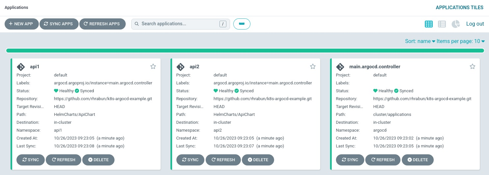

# k8s-argocd-example

_Example project for learning ArgoCD integration._

The idea is to have fully automated CD system for K8s cluster:
* Main ArgoCD controller, which manages other 'worker' controllers;
* Worker ArgoCD controllers which manage applications, written in Helm Charts;
* Applications defined with the Helm Charts for customization convenience;
* Everything can be easily installed with few Terrafom commands.

### Tech Stack:
* K8s  
_For testing purposes docker-desktop is used as K8s cluster. Plan is to test it on AWS EKS as well_
* Terraform  
_Used to install ArgoCD tool into cluster as well as main ArgoCD application, which is going to manage other 'worker' applications_
* ArgoCD  
_GitOps continuous delivery tool used to deploy and manage Dockerized application_
* Python + Docker  
_This project uses my [test-api-for-k8s](https://github.com/rhrabun/test-api-for-k8s) app, which in turn has automated system for building docker images_

### How-To
For convenience there is a Makefile that contains most useful commands.
It has `help` function, which can be executed with `make` or `make help` and it will print available commands with descriptions and params.
